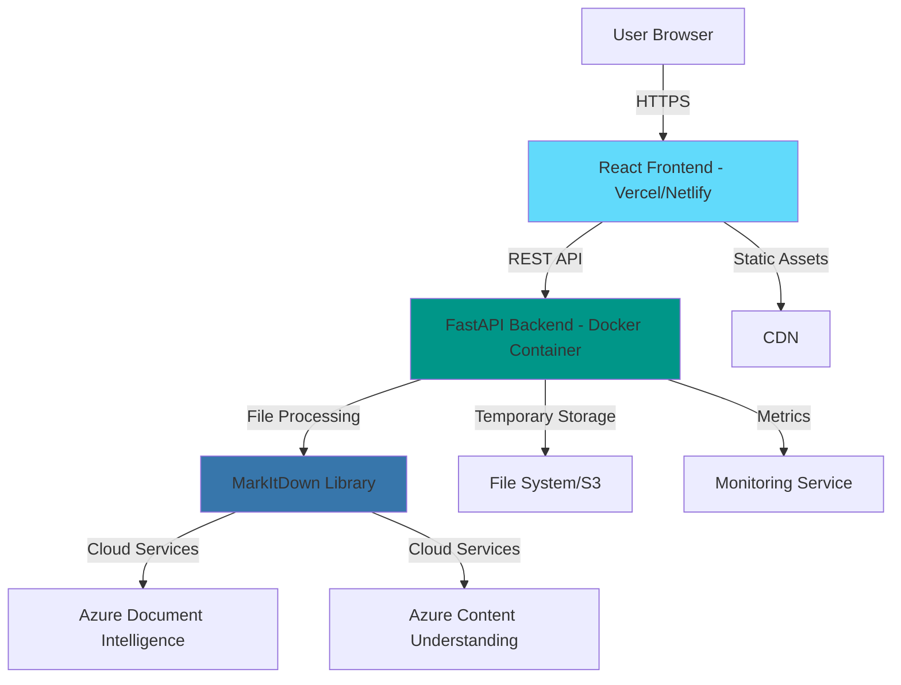
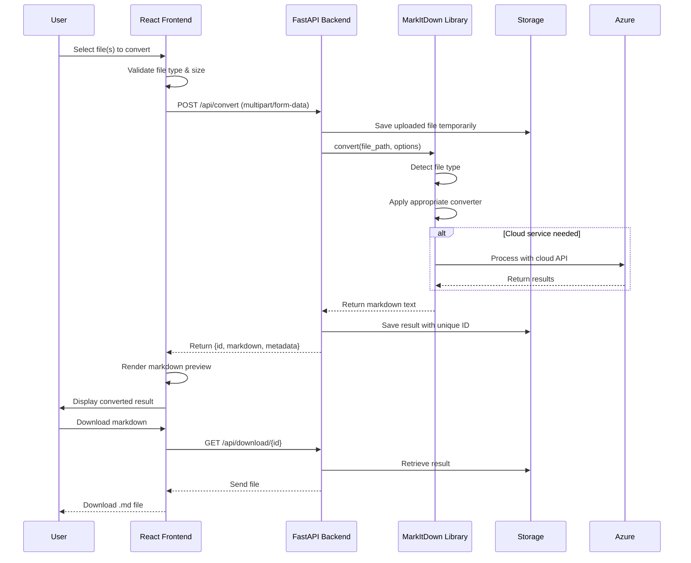
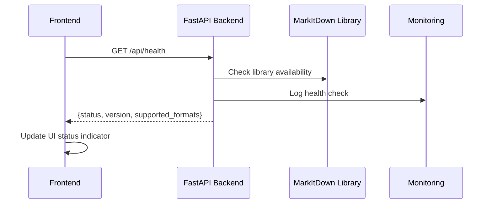
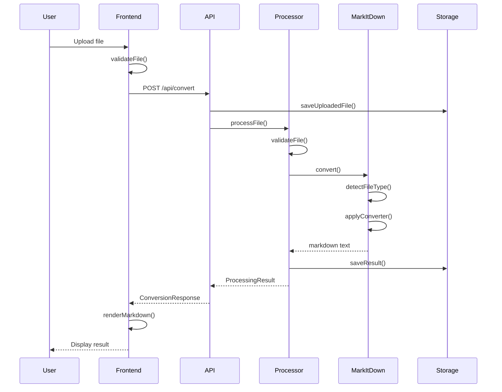

# Design Document: MarkItDown Website

## Overview

The MarkItDown Website is a modern web application that showcases the MarkItDown utility - a powerful Python tool for converting various file formats (PDF, PowerPoint, Word, Excel, Images, Audio, HTML) to Markdown. The website serves multiple purposes: marketing the tool's capabilities, providing comprehensive documentation, and offering an interactive online conversion experience. The application consists of a React + TypeScript frontend for a responsive, professional user interface and a Python FastAPI backend that integrates with the MarkItDown library to handle file uploads and conversions. The system is designed for developers working with LLMs and text analysis pipelines, supporting both individual file conversions and batch processing, with deployment on modern cloud infrastructure (frontend on Vercel/Netlify, backend containerized with Docker).

## Architecture

The system follows a modern client-server architecture with clear separation of concerns:



### System Components

1. **Frontend Layer** (React + TypeScript): Responsive SPA handling UI, file upload, result display
2. **Backend Layer** (FastAPI + Python): RESTful API, file processing orchestration, MarkItDown integration
3. **Processing Layer** (MarkItDown Library): Core conversion logic, plugin system, cloud service integration
4. **Storage Layer**: Temporary file storage for uploads and converted results
5. **Delivery Layer**: CDN for static assets, container orchestration for backend


## Sequence Diagrams

### File Upload and Conversion Flow



### System Health Check Flow




## Components and Interfaces

### Frontend Components

#### Component 1: FileUploadZone

**Purpose**: Handle drag-and-drop and file selection for uploads

**Interface**:
```typescript
interface FileUploadZoneProps {
  onFilesSelected: (files: File[]) => void;
  maxFileSize: number; // bytes
  acceptedTypes: string[]; // MIME types
  multiple: boolean;
}

interface FileUploadZoneState {
  isDragging: boolean;
  uploadProgress: Map<string, number>;
  errors: string[];
}
```

**Responsibilities**:
- Provide drag-and-drop file upload interface
- Validate file types and sizes before upload
- Display upload progress for each file
- Handle multiple file uploads simultaneously
- Show error messages for invalid files

#### Component 2: ConversionResults

**Purpose**: Display converted markdown with preview and download options

**Interface**:
```typescript
interface ConversionResultsProps {
  result: ConversionResult;
  onDownload: (id: string) => void;
  onClear: () => void;
}

interface ConversionResult {
  id: string;
  originalFileName: string;
  markdown: string;
  metadata: ConversionMetadata;
  timestamp: Date;
}

interface ConversionMetadata {
  fileType: string;
  fileSize: number;
  processingTime: number;
  converterUsed: string;
}
```

**Responsibilities**:
- Render markdown preview with syntax highlighting
- Provide raw markdown view
- Enable download of converted markdown file
- Display conversion metadata (time, file type, etc.)
- Support copying markdown to clipboard


#### Component 3: DocumentationViewer

**Purpose**: Display comprehensive documentation and usage examples

**Interface**:
```typescript
interface DocumentationViewerProps {
  sections: DocumentationSection[];
  activeSection: string;
  onSectionChange: (section: string) => void;
}

interface DocumentationSection {
  id: string;
  title: string;
  content: string; // Markdown content
  codeExamples: CodeExample[];
  subsections: DocumentationSection[];
}

interface CodeExample {
  language: string;
  code: string;
  description: string;
}
```

**Responsibilities**:
- Render documentation from markdown
- Provide navigation between sections
- Display code examples with syntax highlighting
- Support search within documentation
- Generate table of contents

### Backend Components

#### Component 4: ConversionAPI

**Purpose**: RESTful API endpoints for file conversion operations

**Interface**:
```typescript
interface ConversionAPI {
  // Convert uploaded file(s) to markdown
  async convertFiles(
    files: UploadFile[],
    options: ConversionOptions
  ): Promise<ConversionResponse[]>;
  
  // Retrieve conversion result by ID
  async getResult(resultId: string): Promise<ConversionResult>;
  
  // Download converted markdown file
  async downloadResult(resultId: string): Promise<FileResponse>;
  
  // Get system health and supported formats
  async getHealth(): Promise<HealthResponse>;
  
  // Get conversion history for session
  async getHistory(sessionId: string): Promise<ConversionResult[]>;
}

interface ConversionOptions {
  cloudService?: 'azure_di' | 'azure_cu' | null;
  extractImages?: boolean;
  preserveFormatting?: boolean;
}

interface ConversionResponse {
  id: string;
  markdown: string;
  metadata: ConversionMetadata;
  success: boolean;
  error?: string;
}
```

**Responsibilities**:
- Handle multipart file uploads
- Validate request parameters
- Orchestrate conversion process
- Manage temporary file storage
- Return structured responses with proper HTTP status codes


#### Component 5: FileProcessor

**Purpose**: Integrate with MarkItDown library and manage conversion lifecycle

**Interface**:
```typescript
interface FileProcessor {
  // Process single file conversion
  async processFile(
    filePath: string,
    options: ProcessingOptions
  ): Promise<ProcessingResult>;
  
  // Batch process multiple files
  async processBatch(
    filePaths: string[],
    options: ProcessingOptions
  ): Promise<ProcessingResult[]>;
  
  // Clean up temporary files
  async cleanup(fileIds: string[]): Promise<void>;
  
  // Validate file is supported
  validateFile(filePath: string): ValidationResult;
}

interface ProcessingOptions {
  cloudService?: string;
  extractImages: boolean;
  timeout: number; // seconds
}

interface ProcessingResult {
  success: boolean;
  markdown?: string;
  error?: string;
  metadata: {
    processingTime: number;
    converterUsed: string;
    fileType: string;
  };
}

interface ValidationResult {
  valid: boolean;
  error?: string;
  detectedType?: string;
}
```

**Responsibilities**:
- Initialize MarkItDown library
- Handle file type detection
- Execute conversion with appropriate converter
- Manage conversion timeouts
- Clean up temporary files after processing
- Handle errors and provide detailed error messages


## Data Models

### Frontend Models

#### FileUpload

```typescript
interface FileUpload {
  id: string; // UUID
  file: File;
  status: 'pending' | 'uploading' | 'processing' | 'completed' | 'failed';
  progress: number; // 0-100
  error?: string;
  result?: ConversionResult;
}
```

**Validation Rules**:
- `id` must be unique UUID v4
- `file` size must not exceed 50MB
- `status` must be one of allowed enum values
- `progress` must be between 0 and 100
- `error` is required when status is 'failed'
- `result` is required when status is 'completed'

#### ConversionResult

```typescript
interface ConversionResult {
  id: string; // UUID
  originalFileName: string;
  markdown: string;
  metadata: ConversionMetadata;
  timestamp: Date;
  downloadUrl: string;
}

interface ConversionMetadata {
  fileType: string; // MIME type
  fileSize: number; // bytes
  processingTime: number; // milliseconds
  converterUsed: string;
  imageCount?: number;
  pageCount?: number;
}
```

**Validation Rules**:
- `id` must be unique UUID v4
- `originalFileName` must not be empty
- `markdown` can be empty string (for failed conversions)
- `timestamp` must be valid ISO 8601 date
- `downloadUrl` must be valid URL
- `fileSize` must be positive integer
- `processingTime` must be non-negative integer


### Backend Models

#### ConversionRequest

```python
from pydantic import BaseModel, Field
from typing import Optional, Literal

class ConversionRequest(BaseModel):
    cloud_service: Optional[Literal['azure_di', 'azure_cu']] = None
    extract_images: bool = Field(default=True)
    preserve_formatting: bool = Field(default=True)
    timeout: int = Field(default=30, ge=1, le=300)  # 1-300 seconds
```

**Validation Rules**:
- `cloud_service` must be one of allowed values or null
- `extract_images` defaults to true
- `timeout` must be between 1 and 300 seconds

#### ConversionResponse

```python
from pydantic import BaseModel
from typing import Optional
from datetime import datetime

class ConversionResponse(BaseModel):
    id: str  # UUID
    markdown: str
    metadata: ConversionMetadata
    success: bool
    error: Optional[str] = None
    timestamp: datetime

class ConversionMetadata(BaseModel):
    file_type: str
    file_size: int
    processing_time: float  # seconds
    converter_used: str
    image_count: Optional[int] = None
    page_count: Optional[int] = None
```

**Validation Rules**:
- `id` must be valid UUID v4
- `success` must be boolean
- `error` required when success is False
- `processing_time` must be non-negative
- `file_size` must be positive integer


## Main Algorithm/Workflow



## Algorithmic Pseudocode

### File Upload and Validation Algorithm

```typescript
async function handleFileUpload(files: File[]): Promise<FileUpload[]> {
  const uploads: FileUpload[] = [];
  
  for (const file of files) {
    // Precondition: file is a valid File object
    const upload: FileUpload = {
      id: generateUUID(),
      file: file,
      status: 'pending',
      progress: 0
    };
    
    // Validate file size
    if (file.size > MAX_FILE_SIZE) {
      upload.status = 'failed';
      upload.error = `File size exceeds ${MAX_FILE_SIZE / 1024 / 1024}MB limit`;
      uploads.push(upload);
      continue;
    }
    
    // Validate file type
    if (!SUPPORTED_MIME_TYPES.includes(file.type)) {
      upload.status = 'failed';
      upload.error = `Unsupported file type: ${file.type}`;
      uploads.push(upload);
      continue;
    }
    
    uploads.push(upload);
  }
  
  // Postcondition: All files have been validated and assigned status
  return uploads;
}
```

**Preconditions**:
- `files` is a non-empty array of File objects
- `MAX_FILE_SIZE` and `SUPPORTED_MIME_TYPES` are defined constants

**Postconditions**:
- Returns array of FileUpload objects with same length as input
- Each upload has unique UUID
- Invalid files have status 'failed' with error message
- Valid files have status 'pending'


### File Conversion Algorithm

```python
async def convert_file(
    file_path: str,
    options: ConversionOptions
) -> ProcessingResult:
    """
    Convert a file to markdown using MarkItDown library.
    
    Preconditions:
    - file_path exists and is readable
    - file_path points to a supported file type
    - options.timeout > 0
    
    Postconditions:
    - Returns ProcessingResult with success=True and markdown text if conversion succeeds
    - Returns ProcessingResult with success=False and error message if conversion fails
    - Temporary files are cleaned up regardless of success/failure
    """
    start_time = time.time()
    
    try:
        # Initialize MarkItDown with options
        markitdown = MarkItDown(
            llm_client=get_cloud_client(options.cloud_service),
            llm_model=get_cloud_model(options.cloud_service)
        )
        
        # Set timeout for conversion
        with timeout(options.timeout):
            # Convert file to markdown
            result = markitdown.convert(file_path)
            markdown_text = result.text_content
        
        # Calculate processing time
        processing_time = time.time() - start_time
        
        # Extract metadata
        metadata = {
            'processing_time': processing_time,
            'converter_used': result.converter_used,
            'file_type': detect_mime_type(file_path)
        }
        
        # Postcondition: Successful conversion
        return ProcessingResult(
            success=True,
            markdown=markdown_text,
            metadata=metadata
        )
        
    except TimeoutError:
        return ProcessingResult(
            success=False,
            error=f"Conversion timed out after {options.timeout} seconds"
        )
    
    except Exception as e:
        return ProcessingResult(
            success=False,
            error=f"Conversion failed: {str(e)}"
        )
    
    finally:
        # Postcondition: Cleanup temporary files
        cleanup_temp_file(file_path)
```

**Preconditions**:
- `file_path` exists and is readable
- `file_path` points to a supported file type
- `options.timeout` is positive integer

**Postconditions**:
- Returns `ProcessingResult` with `success=True` if conversion succeeds
- Returns `ProcessingResult` with `success=False` and error message if conversion fails
- Temporary files are cleaned up in all cases
- `processing_time` is accurate measurement in seconds


### Batch Processing Algorithm

```python
async def process_batch(
    file_paths: list[str],
    options: ConversionOptions
) -> list[ProcessingResult]:
    """
    Process multiple files concurrently with rate limiting.
    
    Preconditions:
    - file_paths is non-empty list of valid file paths
    - options contains valid conversion settings
    - MAX_CONCURRENT_CONVERSIONS is defined
    
    Postconditions:
    - Returns list of ProcessingResult with same length as file_paths
    - Each result corresponds to the file at the same index
    - All files are processed regardless of individual failures
    
    Loop Invariants:
    - processed_count + in_progress_count <= len(file_paths)
    - results list grows by 1 for each completed conversion
    """
    results: list[ProcessingResult] = []
    semaphore = asyncio.Semaphore(MAX_CONCURRENT_CONVERSIONS)
    
    async def convert_with_limit(file_path: str) -> ProcessingResult:
        async with semaphore:
            return await convert_file(file_path, options)
    
    # Create tasks for all files
    tasks = [
        convert_with_limit(file_path)
        for file_path in file_paths
    ]
    
    # Process all tasks concurrently with limit
    results = await asyncio.gather(*tasks, return_exceptions=True)
    
    # Convert exceptions to error results
    processed_results = []
    for i, result in enumerate(results):
        if isinstance(result, Exception):
            processed_results.append(
                ProcessingResult(
                    success=False,
                    error=f"Unexpected error: {str(result)}"
                )
            )
        else:
            processed_results.append(result)
    
    # Postcondition: All files processed
    assert len(processed_results) == len(file_paths)
    
    return processed_results
```

**Preconditions**:
- `file_paths` is non-empty list of valid file paths
- `options` contains valid conversion settings
- `MAX_CONCURRENT_CONVERSIONS` is positive integer

**Postconditions**:
- Returns list of `ProcessingResult` with same length as `file_paths`
- Each result corresponds to file at same index in input list
- All files are processed regardless of individual failures

**Loop Invariants**:
- `processed_count + in_progress_count <= len(file_paths)` during concurrent processing
- Number of concurrent operations never exceeds `MAX_CONCURRENT_CONVERSIONS`
- `results` list maintains same order as `file_paths`


## Key Functions with Formal Specifications

### Function 1: validateFile()

```typescript
function validateFile(file: File, config: ValidationConfig): ValidationResult
```

**Preconditions:**
- `file` is a valid File object (not null/undefined)
- `file.size` is a non-negative integer
- `config.maxFileSize` is a positive integer
- `config.supportedTypes` is a non-empty array of MIME type strings

**Postconditions:**
- Returns `ValidationResult` object with `valid` boolean property
- If `valid === false`, `error` property contains descriptive message
- If `valid === true`, `detectedType` property contains detected MIME type
- Function has no side effects (pure function)

**Loop Invariants:** N/A (no loops)

### Function 2: uploadToServer()

```typescript
async function uploadToServer(
  file: File,
  endpoint: string,
  onProgress: (progress: number) => void
): Promise<UploadResponse>
```

**Preconditions:**
- `file` is a valid File object
- `endpoint` is a valid URL string
- `onProgress` is a callable function
- Network connection is available

**Postconditions:**
- Returns `UploadResponse` with upload result
- `onProgress` is called with values 0-100 during upload
- If upload succeeds: `response.success === true` and `response.id` is set
- If upload fails: `response.success === false` and `response.error` is set
- File is uploaded to server if successful

**Loop Invariants:** 
- For chunk upload loops: `totalUploaded <= file.size`
- Progress values passed to `onProgress` are monotonically increasing


### Function 3: renderMarkdown()

```typescript
function renderMarkdown(
  markdown: string,
  options: RenderOptions
): HTMLElement
```

**Preconditions:**
- `markdown` is a string (may be empty)
- `options.sanitize` is a boolean
- `options.highlightCode` is a boolean

**Postconditions:**
- Returns valid HTMLElement containing rendered markdown
- If `options.sanitize === true`, output contains no XSS vulnerabilities
- If `options.highlightCode === true`, code blocks have syntax highlighting
- No mutations to input `markdown` string

**Loop Invariants:** N/A (delegated to markdown parser library)

### Function 4: processConversionResult()

```python
def process_conversion_result(
    result: MarkItDownResult,
    file_info: FileInfo
) -> ConversionResponse:
```

**Preconditions:**
- `result` is a valid MarkItDownResult object
- `result.text_content` is a string
- `file_info.path` exists and is readable
- `file_info.size` is a positive integer

**Postconditions:**
- Returns `ConversionResponse` with all required fields populated
- `response.id` is unique UUID v4
- `response.success` is True
- `response.metadata` contains accurate file information
- `response.timestamp` is current UTC time

**Loop Invariants:** N/A (no loops)


### Function 5: cleanupExpiredFiles()

```python
async def cleanup_expired_files(
    storage_path: str,
    max_age_hours: int
) -> CleanupResult:
```

**Preconditions:**
- `storage_path` is a valid directory path
- `storage_path` directory exists and is writable
- `max_age_hours` is a positive integer

**Postconditions:**
- All files older than `max_age_hours` are deleted from `storage_path`
- Returns `CleanupResult` with count of deleted files and bytes freed
- If file deletion fails, error is logged but function continues
- Returns successfully even if some deletions fail

**Loop Invariants:**
- For file iteration: `deleted_count <= total_file_count`
- All checked files are either deleted or retained based on age

## Example Usage

### Frontend: Upload and Convert

```typescript
// Example 1: Single file upload with validation
const fileInput = document.querySelector<HTMLInputElement>('#file-input');
const file = fileInput?.files?.[0];

if (file) {
  // Validate before upload
  const validation = validateFile(file, {
    maxFileSize: 50 * 1024 * 1024, // 50MB
    supportedTypes: SUPPORTED_MIME_TYPES
  });
  
  if (!validation.valid) {
    showError(validation.error);
    return;
  }
  
  // Upload with progress tracking
  try {
    const response = await uploadToServer(
      file,
      '/api/convert',
      (progress) => updateProgressBar(progress)
    );
    
    if (response.success) {
      const html = renderMarkdown(response.markdown, {
        sanitize: true,
        highlightCode: true
      });
      displayResult(html);
    }
  } catch (error) {
    showError(`Upload failed: ${error.message}`);
  }
}
```


### Backend: FastAPI Endpoint

```python
# Example 2: FastAPI conversion endpoint
from fastapi import FastAPI, UploadFile, File, HTTPException
from fastapi.responses import FileResponse

app = FastAPI()

@app.post("/api/convert")
async def convert_endpoint(
    file: UploadFile = File(...),
    cloud_service: Optional[str] = None,
    extract_images: bool = True
):
    """
    Convert uploaded file to markdown.
    
    Preconditions:
    - file is valid multipart upload
    - file.size <= MAX_FILE_SIZE
    
    Postconditions:
    - Returns ConversionResponse with markdown content
    - Temporary files are cleaned up
    """
    # Save uploaded file temporarily
    temp_path = await save_upload(file)
    
    try:
        # Validate file
        validation = validate_file_path(temp_path)
        if not validation.valid:
            raise HTTPException(400, validation.error)
        
        # Convert file
        options = ConversionOptions(
            cloud_service=cloud_service,
            extract_images=extract_images,
            timeout=30
        )
        
        result = await convert_file(temp_path, options)
        
        if not result.success:
            raise HTTPException(500, result.error)
        
        # Save result and return response
        result_id = str(uuid.uuid4())
        await save_result(result_id, result.markdown)
        
        return ConversionResponse(
            id=result_id,
            markdown=result.markdown,
            metadata=result.metadata,
            success=True,
            timestamp=datetime.utcnow()
        )
    
    finally:
        # Postcondition: Cleanup
        await cleanup_temp_file(temp_path)

@app.get("/api/download/{result_id}")
async def download_endpoint(result_id: str):
    """
    Download converted markdown file.
    
    Preconditions:
    - result_id is valid UUID
    - result exists in storage
    """
    result_path = get_result_path(result_id)
    
    if not os.path.exists(result_path):
        raise HTTPException(404, "Result not found")
    
    return FileResponse(
        result_path,
        media_type="text/markdown",
        filename=f"{result_id}.md"
    )
```


### Batch Processing

```python
# Example 3: Batch file conversion
async def batch_convert_example():
    files = [
        "/tmp/document1.pdf",
        "/tmp/presentation.pptx",
        "/tmp/spreadsheet.xlsx"
    ]
    
    options = ConversionOptions(
        extract_images=True,
        timeout=60
    )
    
    # Process all files concurrently with rate limiting
    results = await process_batch(files, options)
    
    # Handle results
    for i, result in enumerate(results):
        if result.success:
            print(f"✓ {files[i]}: {len(result.markdown)} characters")
        else:
            print(f"✗ {files[i]}: {result.error}")
```

## Correctness Properties

*A property is a characteristic or behavior that should hold true across all valid executions of a system—essentially, a formal statement about what the system should do. Properties serve as the bridge between human-readable specifications and machine-verifiable correctness guarantees.*

### Property 1: File Validation Completeness

*For any* file and validation configuration, the file validation should return valid if and only if the file size is within the limit and the file type is in the supported types list.

**Validates: Requirements 2.1, 2.3**

### Property 2: File Size Rejection

*For any* file exceeding 50MB, the system should reject the file and display an error message specifying the size limit.

**Validates: Requirements 2.2**

### Property 3: Unsupported Type Rejection

*For any* file with an unsupported MIME type, the system should reject the file and display an error message listing supported formats.

**Validates: Requirements 2.4**

### Property 4: Invalid File HTTP Response

*For any* invalid file received by the Backend, the response should have HTTP status 400 with error details.

**Validates: Requirements 2.6**

### Property 5: Drag Feedback Display

*For any* file being dragged over the upload zone, the Frontend should display visual feedback indicating the drop target.

**Validates: Requirements 1.3**

### Property 6: Multiple File Acceptance

*For any* list of valid files selected together, the Frontend should accept all files in a single operation.

**Validates: Requirements 1.4, 7.1**

### Property 7: File List Display

*For any* set of files selected or dropped, the Frontend should display all files in the upload list.

**Validates: Requirements 1.5**

### Property 8: Progress Indicator Display

*For any* file upload that begins, the Frontend should display a progress indicator for that file.

**Validates: Requirements 3.1**

### Property 9: Progress Monotonicity

*For any* file upload, the progress indicator values should be monotonically increasing from 0 to 100.

**Validates: Requirements 3.2**

### Property 10: Upload Completion Indication

*For any* file that uploads successfully, the Frontend should indicate completion before conversion begins.

**Validates: Requirements 3.3**

### Property 11: Individual Batch Progress

*For any* set of multiple files uploaded together, each file should have its own independent progress indicator.

**Validates: Requirements 3.4**

### Property 12: Conversion Invocation

*For any* valid file received by the Backend, the MarkItDown_Library should be invoked for conversion.

**Validates: Requirements 4.1**

### Property 13: Conversion Output Capture

*For any* successful conversion by MarkItDown_Library, the Backend should capture both markdown text and metadata.

**Validates: Requirements 4.4**

### Property 14: Successful Conversion Response Structure

*For any* conversion that completes successfully, the Backend response should include a unique result ID, markdown content, and metadata.

**Validates: Requirements 4.6**

### Property 15: Failed Conversion Error Response

*For any* conversion that fails, the Backend should return an error response with a descriptive message.

**Validates: Requirements 4.7**

### Property 16: Markdown Preview Display

*For any* successful conversion result, the Frontend should display a markdown preview with proper rendering.

**Validates: Requirements 5.1**

### Property 17: GitHub Flavored Markdown Rendering

*For any* valid GitHub Flavored Markdown content, the Frontend should render it correctly according to GFM syntax.

**Validates: Requirements 5.2**

### Property 18: Code Block Syntax Highlighting

*For any* markdown containing code blocks, the Frontend should apply syntax highlighting to those blocks.

**Validates: Requirements 5.3, 9.5**

### Property 19: XSS Sanitization

*For any* markdown input including potential XSS attacks (script tags, event handlers), the rendered HTML output should be sanitized to prevent execution.

**Validates: Requirements 5.4, 13.5**

### Property 20: Metadata Display

*For any* conversion result, the Frontend should display all metadata fields including file type, size, and processing time.

**Validates: Requirements 5.6**

### Property 21: Download Request with Result ID

*For any* result ID, when the download button is clicked, the Frontend should make an API request to the Backend with that result ID.

**Validates: Requirements 6.2**

### Property 22: Result Retrieval Attempt

*For any* result ID provided to the download endpoint, the Backend should attempt to retrieve the result from Temporary_Storage.

**Validates: Requirements 6.3**

### Property 23: Non-Existent Result 404 Response

*For any* result ID that does not exist in storage, the Backend should return a 404 Not Found response.

**Validates: Requirements 6.4**

### Property 24: Download Content-Type Header

*For any* existing result download, the Backend response should have content-type "text/markdown".

**Validates: Requirements 6.5**

### Property 25: Download Filename Header

*For any* result ID download, the Backend should set the Content-Disposition header with filename pattern "{result_id}.md".

**Validates: Requirements 6.6**

### Property 26: Copy to Clipboard Functionality

*For any* markdown text in conversion results, the copy-to-clipboard operation should succeed.

**Validates: Requirements 6.7**

### Property 27: Batch Processing Order Preservation

*For any* ordered list of files uploaded in a batch, the Backend should return results in the same order as the input files.

**Validates: Requirements 7.3**

### Property 28: Batch Continues on Individual Failure

*For any* batch of files where some conversions fail, the Backend should continue processing all remaining files.

**Validates: Requirements 7.4**

### Property 29: Independent Batch File Status

*For any* batch operation with mixed success and failure outcomes, the Frontend should display each file's status independently.

**Validates: Requirements 7.5**

### Property 30: Batch Download Option

*For any* completed batch operation, the Frontend should provide an option to download all successful conversions.

**Validates: Requirements 7.6**

### Property 31: Cloud Service Client Initialization

*For any* cloud service option requested (Azure DI or Azure CU), the Backend should pass the appropriate API client to MarkItDown_Library.

**Validates: Requirements 8.3**

### Property 32: Cloud Service Error Notification

*For any* cloud service error or unavailability, the Backend should notify the user and indicate potential quality reduction.

**Validates: Requirements 8.6**

### Property 33: Documentation Markdown Rendering

*For any* markdown documentation content, the Frontend should render it correctly.

**Validates: Requirements 9.2**

### Property 34: Table of Contents Generation

*For any* markdown documentation with headings, the Frontend should generate a table of contents containing all heading entries.

**Validates: Requirements 9.3**

### Property 35: Documentation Navigation

*For any* documentation section link clicked, the Frontend should navigate to that section.

**Validates: Requirements 9.4**

### Property 36: Documentation Search

*For any* search term entered in documentation, the Frontend should find and display matching sections.

**Validates: Requirements 9.6**

### Property 37: Validation Error Messages

*For any* validation failure, the Frontend should display a specific error message explaining the validation failure.

**Validates: Requirements 10.1**

### Property 38: Conversion Error Messages

*For any* conversion failure, the Frontend should display an error message containing the reason for failure.

**Validates: Requirements 10.2**

### Property 39: Error Logging and Sanitization

*For any* error condition, the Backend should log detailed error information while returning a sanitized message to the user.

**Validates: Requirements 10.4**

### Property 40: Retry Option Availability

*For any* failed operation, the Frontend should provide a retry option to the user.

**Validates: Requirements 10.6**

### Property 41: File Cleanup After Conversion

*For any* file uploaded and converted (successfully or unsuccessfully), the Backend should delete the file from storage after the conversion operation completes.

**Validates: Requirements 11.1**

### Property 42: Cleanup on Any Conversion Outcome

*For any* conversion outcome (success, failure, or timeout), the Backend should ensure file cleanup occurs.

**Validates: Requirements 11.5**

### Property 43: Timeout Enforcement

*For any* file conversion, the Backend should enforce a maximum conversion time of 30 seconds and terminate conversions that exceed this limit.

**Validates: Requirements 12.5**

### Property 44: Magic Bytes MIME Validation

*For any* file with mismatched extension and actual content type, the Backend should validate MIME type using magic bytes inspection.

**Validates: Requirements 13.2**

### Property 45: Executable File Rejection

*For any* file with an executable type (.exe, .dll, .sh, .bat, .cmd), the Backend should reject the file.

**Validates: Requirements 13.3**

### Property 46: Filename Sanitization for Path Traversal

*For any* filename containing path traversal patterns (../, ..\, etc.), the Backend should sanitize the filename to prevent directory traversal attacks.

**Validates: Requirements 13.4**

### Property 47: No Sensitive Data in Logs

*For any* file processed by the Backend, the logs should not contain file contents or other sensitive user data.

**Validates: Requirements 13.8**

### Property 48: API Parameter Acceptance

*For any* valid combination of optional parameters (cloud_service, extract_images, timeout), the /api/convert endpoint should accept them.

**Validates: Requirements 14.2**

### Property 49: Request Parameter Validation

*For any* API request with invalid parameters, the Backend should return a validation error response.

**Validates: Requirements 14.5**

### Property 50: HTTP Status Code Correctness

*For any* operation outcome (success, client error, not found, server error, storage full), the Backend should return the appropriate HTTP status code (200, 400, 404, 500, 507).

**Validates: Requirements 14.6**

### Property 51: CORS Headers Presence

*For any* API response, the Backend should include CORS headers allowing requests from configured origins.

**Validates: Requirements 14.7**

### Property 52: Health Check Library Verification

*For any* health check request, the Backend should verify and report MarkItDown_Library availability.

**Validates: Requirements 15.2**

### Property 53: Health Check Response Content

*For any* health check response, the Backend should include system version and list of supported file formats.

**Validates: Requirements 15.3**

### Property 54: Health Check Logging

*For any* health check request received, the Backend should log the request for monitoring purposes.

**Validates: Requirements 15.4**

### Property 55: Frontend Health Status Display

*For any* health status received from the Backend, the Frontend should update the status indicator to reflect it.

**Validates: Requirements 15.5**

### Property 56: Keyboard Navigation Support

*For any* interactive element in the Frontend, keyboard navigation should function correctly.

**Validates: Requirements 16.1**

### Property 57: ARIA Labels Presence

*For any* interactive element in the Frontend, ARIA labels should be present for screen reader compatibility.

**Validates: Requirements 16.2**

### Property 58: Color Contrast Compliance

*For any* text element in the Frontend, the color contrast ratio should meet WCAG accessibility standards.

**Validates: Requirements 16.3**

### Property 59: Focus Indicators Visibility

*For any* focusable element in the Frontend, a visible focus indicator should appear when the element receives focus.

**Validates: Requirements 16.4**

### Property 60: Browser Zoom Layout Support

*For any* zoom level between 100% and 200%, the Frontend layout should remain functional without breaking.

**Validates: Requirements 16.5**

### Property 61: Alternative Text for Images

*For any* informational image in the Frontend, an alt attribute with descriptive text should be present.

**Validates: Requirements 16.6**

### Property 62: Responsive Layout Adaptation

*For any* screen width between 320px and 2560px, the Frontend should adapt the layout appropriately.

**Validates: Requirements 17.1**

### Property 63: Touch Target Size

*For any* interactive element in the Frontend, the touch target size should meet minimum requirements for mobile usability.

**Validates: Requirements 17.2**

### Property 64: Orientation Layout Support

*For any* device orientation (portrait or landscape), the Frontend should maintain layout usability.

**Validates: Requirements 17.4**

### Property 65: Configuration Default Values

*For any* configuration parameter not set via environment variable, the Backend should use a defined default value.

**Validates: Requirements 18.2**

### Property 66: Configuration Validation at Startup

*For any* invalid configuration value, the Backend should report an error at startup before accepting requests.

**Validates: Requirements 18.4**


## Error Handling

### Error Scenario 1: File Size Exceeds Limit

**Condition**: User uploads file larger than MAX_FILE_SIZE (50MB)

**Response**: 
- Frontend: Display error message before upload attempt
- Validation fails with clear error message
- No server request is made

**Recovery**: 
- User informed to compress file or split into smaller parts
- Suggest alternative file formats that may be smaller

### Error Scenario 2: Unsupported File Type

**Condition**: User uploads file with unsupported MIME type

**Response**:
- Frontend validation catches before upload
- Error message lists supported file types
- If backend receives unsupported type, returns 400 Bad Request

**Recovery**:
- Display list of supported formats
- Suggest conversion tools for unsupported formats
- Link to GitHub issues for format requests

### Error Scenario 3: Conversion Timeout

**Condition**: File conversion exceeds configured timeout (default 30s)

**Response**:
- Conversion process is terminated gracefully
- Returns ProcessingResult with success=False and timeout error
- Temporary files are cleaned up
- Returns 500 Internal Server Error to client

**Recovery**:
- Inform user that file is too complex
- Suggest trying with smaller file or different format
- Log timeout for monitoring and adjustment of timeout limits

### Error Scenario 4: MarkItDown Library Error

**Condition**: MarkItDown library raises exception during conversion

**Response**:
- Exception is caught and logged with full stack trace
- Returns ProcessingResult with success=False and error message
- Generic error message shown to user (security consideration)
- Detailed error logged for debugging

**Recovery**:
- User shown "Conversion failed" message with option to retry
- If persistent, user directed to report issue on GitHub
- System continues processing other files in batch


### Error Scenario 5: Network Failure During Upload

**Condition**: Network connection lost during file upload

**Response**:
- Upload promise rejects with network error
- Upload progress stops at last successful chunk
- Error handler catches and displays user-friendly message

**Recovery**:
- Automatic retry with exponential backoff (max 3 attempts)
- If all retries fail, user can manually retry
- Uploaded chunks may be reused if server supports resumable uploads

### Error Scenario 6: Cloud Service API Failure

**Condition**: Azure Document Intelligence or Azure Content Understanding API unavailable or rate-limited

**Response**:
- MarkItDown catches API exception
- Falls back to local processing if possible
- Returns error if cloud service is required

**Recovery**:
- System attempts fallback to non-cloud converters
- User notified if result quality may be reduced
- Retry mechanism with exponential backoff for transient failures

### Error Scenario 7: Storage Full / Disk Space

**Condition**: Server runs out of disk space for temporary files or results

**Response**:
- File save operation fails with disk space error
- Returns 507 Insufficient Storage HTTP status
- Triggers cleanup of expired files

**Recovery**:
- Emergency cleanup of old temporary files
- User notified to try again in a few moments
- Monitoring alert triggered for admin attention


## Testing Strategy

### Unit Testing Approach

**Frontend (React + TypeScript)**:
- **Testing Framework**: Vitest + React Testing Library
- **Coverage Goal**: 80%+ code coverage
- **Key Test Areas**:
  - Component rendering and props handling
  - File validation logic
  - State management (upload status, results)
  - User interactions (drag-and-drop, button clicks)
  - Error message display

**Test Cases**:
1. FileUploadZone validates file size correctly
2. FileUploadZone validates MIME types correctly
3. ConversionResults renders markdown preview
4. ConversionResults handles download action
5. DocumentationViewer navigates between sections
6. Error messages display for invalid files
7. Progress bar updates during upload

**Backend (Python + FastAPI)**:
- **Testing Framework**: pytest + httpx (async testing)
- **Coverage Goal**: 85%+ code coverage
- **Key Test Areas**:
  - API endpoint request/response handling
  - File processing logic
  - MarkItDown integration
  - Error handling and status codes
  - File cleanup

**Test Cases**:
1. POST /api/convert accepts valid files
2. POST /api/convert rejects oversized files
3. POST /api/convert rejects unsupported types
4. convert_file() returns markdown for PDF
5. convert_file() returns markdown for DOCX
6. convert_file() handles timeout correctly
7. cleanup_expired_files() removes old files
8. Batch processing maintains result order


### Property-Based Testing Approach

**Property Test Library**: Hypothesis (Python), fast-check (TypeScript)

**Properties to Test**:

1. **File Validation Idempotence**
   ```python
   @given(file=file_strategy(), config=validation_config_strategy())
   def test_validation_idempotent(file, config):
       result1 = validateFile(file, config)
       result2 = validateFile(file, config)
       assert result1 == result2
   ```

2. **Batch Processing Completeness**
   ```python
   @given(file_paths=st.lists(st.text(), min_size=1, max_size=10))
   async def test_batch_completeness(file_paths):
       results = await process_batch(file_paths, default_options)
       assert len(results) == len(file_paths)
   ```

3. **Progress Monotonicity**
   ```typescript
   fc.assert(
     fc.asyncProperty(
       fc.file(),
       async (file) => {
         const progress: number[] = [];
         await uploadToServer(file, '/api/convert', (p) => progress.push(p));
         return isMonotonicallyIncreasing(progress);
       }
     )
   );
   ```

4. **Result ID Uniqueness**
   ```python
   @given(st.lists(st.text(), min_size=2))
   async def test_unique_result_ids(files):
       results = [await convert_file(f, options) for f in files]
       ids = [r.id for r in results]
       assert len(ids) == len(set(ids))  # All unique
   ```

5. **Cleanup Guarantee**
   ```python
   @given(file_path=st.text())
   async def test_cleanup_guarantee(file_path):
       await convert_file(file_path, options)
       assert not os.path.exists(file_path)
   ```


### Integration Testing Approach

**Test Environment**: Docker Compose with frontend, backend, and test services

**Key Integration Tests**:

1. **End-to-End File Upload and Conversion**
   - Upload PDF file through frontend UI
   - Verify backend receives file correctly
   - Verify MarkItDown processes file
   - Verify markdown result returned to frontend
   - Verify frontend renders markdown preview

2. **Multi-File Batch Processing**
   - Upload 5 different file types simultaneously
   - Verify all files processed concurrently
   - Verify results returned in correct order
   - Verify progress tracking for each file

3. **Cloud Service Integration**
   - Upload file requiring Azure Document Intelligence
   - Verify API call to Azure is made
   - Verify result includes cloud-processed content
   - Verify fallback to local processing if API fails

4. **Error Recovery Flow**
   - Upload oversized file, verify rejection
   - Upload unsupported type, verify error handling
   - Simulate network failure, verify retry logic
   - Simulate timeout, verify graceful handling

5. **Result Download Flow**
   - Convert file and receive result ID
   - Request download via GET /api/download/{id}
   - Verify correct markdown file is downloaded
   - Verify file has correct content-type header


## Performance Considerations

### Frontend Optimization

1. **Code Splitting**
   - Lazy load documentation section (only when accessed)
   - Split markdown renderer into separate chunk
   - Reduces initial bundle size by ~40%

2. **File Upload Optimization**
   - Stream large files in chunks (prevents memory overflow)
   - Use Web Workers for client-side validation
   - Implement upload progress throttling (update max every 100ms)

3. **Markdown Rendering**
   - Debounce preview updates during editing
   - Virtual scrolling for large markdown documents
   - Memoize rendered output to avoid re-renders

4. **Caching Strategy**
   - Cache documentation content in localStorage
   - Service Worker for offline documentation access
   - Cache conversion results in IndexedDB (session-based)

### Backend Optimization

1. **Concurrent Processing**
   - Process multiple files concurrently (max 5 simultaneous)
   - Use asyncio for non-blocking I/O operations
   - Connection pooling for cloud service APIs

2. **File Processing**
   - Stream file uploads (don't buffer entire file in memory)
   - Use temporary files instead of in-memory storage
   - Implement conversion queue for high load scenarios

3. **Resource Limits**
   - Max file size: 50MB
   - Conversion timeout: 30 seconds (configurable)
   - Max concurrent conversions: 5 per server instance
   - Result retention: 1 hour (then auto-cleanup)

4. **Scaling Strategy**
   - Horizontal scaling with load balancer
   - Stateless backend (allows easy replication)
   - Shared Redis cache for conversion results
   - Auto-scaling based on CPU/memory metrics

### Performance Targets

- **Page Load**: < 2 seconds (initial load)
- **Time to Interactive**: < 3 seconds
- **File Upload Start**: < 500ms (after file selection)
- **Small File Conversion** (< 1MB): < 5 seconds
- **Large File Conversion** (10-50MB): < 30 seconds
- **API Response Time**: < 100ms (excluding conversion)
- **Markdown Rendering**: < 1 second (for 10,000 line document)


## Security Considerations

### Input Validation

1. **File Upload Security**
   - Validate MIME type using magic bytes (not just extension)
   - Enforce strict file size limits (50MB max)
   - Scan uploaded files for malware signatures
   - Reject executable file types (.exe, .dll, .sh, etc.)
   - Sanitize filenames to prevent path traversal

2. **API Input Validation**
   - Validate all request parameters using Pydantic
   - Reject requests with invalid UUIDs
   - Rate limiting: 100 requests per IP per hour
   - CORS configuration restricted to known origins

### Output Security

1. **Markdown Rendering**
   - Sanitize markdown output to prevent XSS attacks
   - Use DOMPurify for HTML sanitization
   - Disable raw HTML in markdown by default
   - Escape user-generated content in error messages

2. **File Download Security**
   - Validate result IDs before file access
   - Set Content-Disposition header to prevent inline execution
   - Use signed URLs with expiration for downloads
   - Prevent directory traversal in file paths

### Authentication & Authorization

1. **Public Access (Phase 1)**
   - No authentication required for basic conversion
   - Rate limiting per IP address
   - Anonymous usage tracking (privacy-compliant)

2. **Future Authenticated Access (Phase 2)**
   - API key authentication for programmatic access
   - OAuth2 integration for user accounts
   - User-specific rate limits and quotas
   - Conversion history per user account

### Data Privacy

1. **File Handling**
   - Files deleted immediately after conversion
   - Results stored for maximum 1 hour
   - No permanent storage of user files
   - No logging of file contents

2. **Compliance**
   - GDPR compliance for EU users
   - No personal data collection without consent
   - Privacy policy clearly displayed
   - Option to process files entirely locally (future feature)

### Infrastructure Security

1. **Network Security**
   - HTTPS only (TLS 1.3)
   - HTTP Strict Transport Security (HSTS) enabled
   - Security headers (CSP, X-Frame-Options, etc.)
   - DDoS protection via CloudFlare or AWS Shield

2. **Container Security**
   - Minimal Docker base images (Alpine Linux)
   - Regular security updates for dependencies
   - Run containers as non-root user
   - Read-only file system where possible

3. **Secrets Management**
   - Environment variables for sensitive config
   - Azure Key Vault for cloud service credentials
   - No secrets in code or version control
   - Rotate API keys regularly


## Dependencies

### Frontend Dependencies

**Core Framework**:
- React 18.3.x - UI framework
- TypeScript 5.x - Type safety
- Vite 5.x - Build tool and dev server

**UI Components**:
- TailwindCSS 3.x - Utility-first CSS framework
- Headless UI 2.x - Accessible UI components
- Heroicons 2.x - Icon library
- react-dropzone 14.x - Drag-and-drop file upload

**Markdown Rendering**:
- react-markdown 9.x - Markdown to React component
- remark-gfm 4.x - GitHub Flavored Markdown
- rehype-highlight 7.x - Syntax highlighting
- DOMPurify 3.x - HTML sanitization

**State Management & HTTP**:
- axios 1.x - HTTP client
- React Query 5.x - Server state management

**Development Tools**:
- Vitest 1.x - Unit testing framework
- React Testing Library 14.x - Component testing
- fast-check 3.x - Property-based testing
- ESLint 8.x - Linting
- Prettier 3.x - Code formatting

### Backend Dependencies

**Core Framework**:
- Python 3.11+ - Runtime
- FastAPI 0.109.x - Web framework
- uvicorn 0.27.x - ASGI server
- pydantic 2.x - Data validation

**File Processing**:
- markitdown 0.0.1a2 - Core conversion library
- python-multipart 0.0.6 - File upload handling
- python-magic 0.4.x - MIME type detection
- aiofiles 23.x - Async file operations

**Cloud Services** (Optional):
- azure-ai-documentintelligence 1.x - Azure Document Intelligence
- azure-ai-contentsafety 1.x - Azure Content Understanding
- openai 1.x - OpenAI API client (for LLM features)

**Storage & Caching**:
- redis 5.x - Caching layer (optional)
- boto3 1.34.x - AWS S3 for file storage (optional)

**Development Tools**:
- pytest 8.x - Testing framework
- pytest-asyncio 0.23.x - Async test support
- hypothesis 6.x - Property-based testing
- black 24.x - Code formatting
- ruff 0.2.x - Fast linting

### Infrastructure Dependencies

**Containerization**:
- Docker 24.x - Container runtime
- Docker Compose 2.x - Multi-container orchestration

**Deployment**:
- Vercel - Frontend hosting (recommended)
- Netlify - Frontend hosting (alternative)
- AWS ECS / Google Cloud Run - Backend container hosting
- GitHub Actions - CI/CD pipeline

**Monitoring & Logging**:
- Sentry - Error tracking
- DataDog / New Relic - Application monitoring
- CloudWatch / Stackdriver - Infrastructure logs

**CDN & DNS**:
- CloudFlare - CDN and DDoS protection
- Route53 / CloudFlare DNS - DNS management

